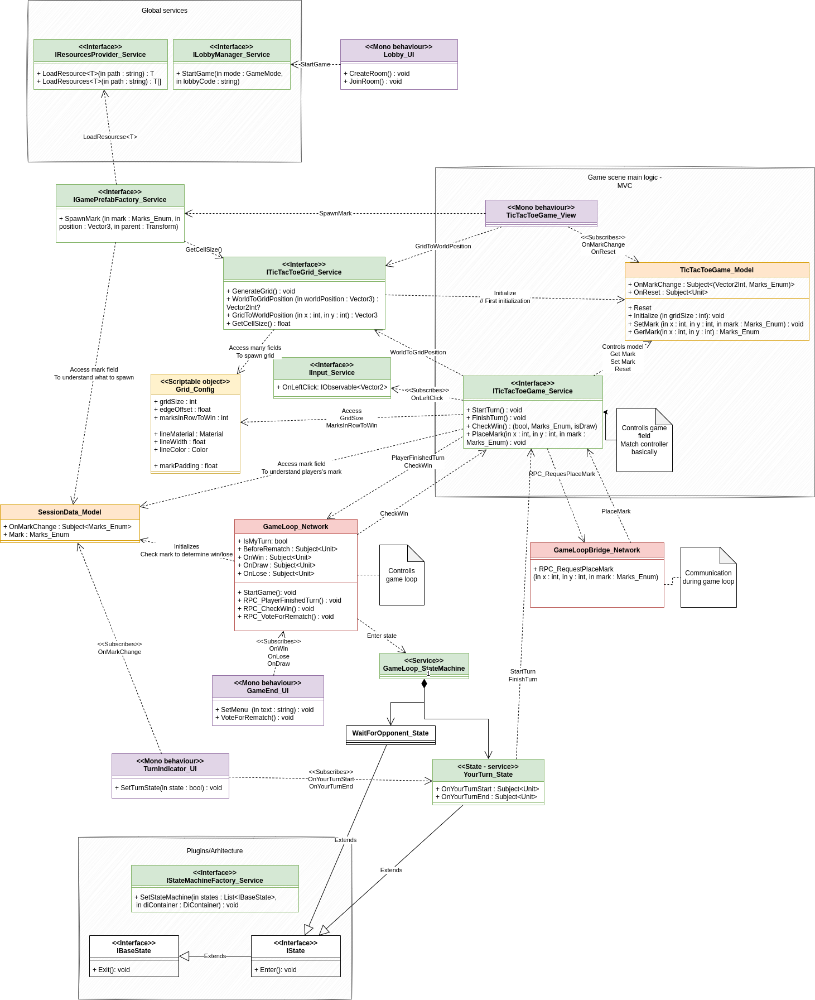

# Russian
ТЗ: сделать крестики-нолики. Для нетворкинга использовать photon fusion. Не использовать паттерн MVVM

Я привык писать документацию на английском, поэтому подробное описание будет именно на нем
На русском я записал видео с кратким показом репозитория и архитектурных решений:
https://youtu.be/_zwpbCFWbF8

Кодовая база может содержать некоторые недочеты.

# English
Technical specification: Make a tic-tac-toe game. Use photon fusion for networking. Don't use MVVM

Here is the video with the detailed description:
https://youtu.be/GzPqtGURxjg

Additionally, I made a UML scheme:

Diagram source file is available here (draw.io):
[source](Diagram.drawio)

## Architectural decisions 
### Plugins/Architecture
I moved some code to a plugin section. To be more precise:
* State machine factory and base states
* Extensions
I did it because:
* Some generic code can move from project to project. This would help re-use code in other projects and make code more modular overall
* Separates immutable code from the rest of the project. This reduces code base, leading to better understanding of project structure

### State machine
It's a very simple implementation of a state machine. However, for a project of this size state machine was definitely an overkill.
I did it because state machine in my opinion is essential for turn-based games, especially for multiplayer ones
(because in multiplayer ones we usually have more states, such as waiting for opponent or responses to enemy moves)
State machine makes turn based games development so much easier and I wanted to show the concept.
You can isolate various parts of the game logic from each other, control moves with high precision and handle any amount of players easily

### Subscriptions
With the help of subscriptions (example of dependency inversion) no classes depend on views (UI):
* Because views are the highest level components, they are very unstable (can change a lot), so depending on them can reduce code stability
* We don't need to bind/inject them
* We can easily change view implementations

### Some extra words
The rest of the project is fairly straightforward. I think other decisions are obvious, so no reason to overexplain things.
Code base can also be imperfect, because this is a small project. I didn't want to overcomplicate things, so I didn't use Addressables and so on.
State machine and other complex decisions were added to show general idea for long-term maintainability and modularity of code base.
They serve as guidance, not as a final implementation.